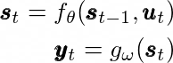

# Many-to-many data preprocessing in TimeseriesGenerator

| Status        | (Proposed / Accepted / Implemented / Obsolete)       |
:-------------- |:---------------------------------------------------- |
| **Author(s)** | Marat Kopytjuk (kopytjuk@gmail.com)                  |
| **Sponsor**   |                   |
| **Updated**   | 2020-04-10                                         |

## Objective

Currently the `TimeseriesGenerator` class only supports many-to-one model architectures (scenario 1).


Source: [link](http://karpathy.github.io/2015/05/21/rnn-effectiveness/)

The goal of this RFC to extend the existing `TimeseriesGenerator` to the 4. and 5. usecase shown above.

## Motivation

A common use-case comes from engineering domain (control theory) 
where the user models nonlinear dynamical systems based on input and output timeseries.

Those models usually modeled as state-space systems where the next system state **s** 
is modelled as a function of current state and the current input vector **u**:



The recurrent part `f_theta` calculates the next state (green blocks) given inputs (red), 
the stateless part `g_omega` calculates the output (blue). 

See [here](https://www.cs.toronto.edu/~tingwuwang/rnn_tutorial.pdf) for details.

In order to train those systems the model has to be fed like in many-to-many scenario above (5). 
Users have to write custom code to prepare their datasets which can be done with 
`TimeseriesGenerator` in a more generic and "common" way.

## User Benefit

Support for data-preprocessing for dynamical system modelling (recurrent many-to-many architectures).

Users don't have to maintain own codebase for data preparation and can use 
"off-the-shelf" `keras` helper utilites.

## Design Proposal

Current workflow while modelling dynamical systems:

```python
from keras.models import Sequential
from keras.layers import TimeDistributed, SimpleRNN, Dense
from keras.utils import Sequence

import numpy as np
import math

# Assume we have recorded a large measurement with 1000 timestamps
# from a system with two inputs and one output
input_dim = 2
output_dim = 1
num_timestamps = 1000

X = np.random.randn(num_timestamps, input_dim)
Y = np.random.randn(num_timestamps, output_dim)

# prepare data for training on sequences consisting of
# 100 timestamps
T = 100
n_samples = num_timestamps//T

assert n_samples == 10

# batch consists of 3 sequences of length T
batch_size = 3
n_batches = math.ceil(n_samples / batch_size)

assert n_batches == 4

# preallocate training matrices
X_train = np.zeros((n_batches, batch_size, T, input_dim))
Y_train = np.zeros((n_batches, batch_size, T, output_dim))

# fill data into training matrices
for b in range(n_batches):
    batch_start_idx = b*batch_size*T
    batch_end_idx = min((b+1)*batch_size*T, num_timestamps)
    num_samples = (batch_end_idx-batch_start_idx)//T
    X_train[b] = X[batch_start_idx:batch_end_idx, :].reshape((num_samples, T, input_dim))
    Y_train[b] = Y[batch_start_idx:batch_end_idx, :].reshape((num_samples, T, output_dim))

# custom sequence class
class CustomSequence(Sequence):

    def __init__(self, x, y):
        self.x, self.y = x, y

    def __len__(self):
        return len(self.x)

    def __getitem__(self, idx):
        return self.x[idx], self.y[idx]

cs = CustomSequence(X_train, Y_train)

# define many-to-many model
model = Sequential()
model.add(SimpleRNN(5, return_sequences=True,
                    input_shape=(T, input_dim)))
model.add(TimeDistributed(Dense(output_dim, activation="linear")))

model.compile(optimizer="sgd", loss="mse")

model.fit(cs, epochs=2)
```

There is a lot of hard readable code for filling in training matrices.

A flag in `TimeseriesGenerator` could simplify the data preprocessing:

```python
data_gen = sequence.TimeseriesGenerator(data, targets,
                                            length=10,
                                            sampling_rate=1,
                                            stride=10,
                                            batch_size=2,
                                            return_sequences=True)
from keras.models import Sequential
from keras.layers import TimeDistributed, SimpleRNN, Dense
from keras.utils import Sequence

import numpy as np
import math

# Assume we have recorded a large measurement with 1000 timestamps
# from a system with two inputs and one output
input_dim = 2
output_dim = 1
num_timestamps = 1000

X = np.random.randn(num_timestamps, input_dim)
Y = np.random.randn(num_timestamps, output_dim)

# prepare data for training on sequences consisting of
# 100 timestamps
T = 100

cs = TimeseriesGenerator(X, Y, length=T, sampling_rate=1, stride=T, 
                            batch_size=3, return_sequences=True)

# define many-to-many model
model = Sequential()
model.add(SimpleRNN(5, return_sequences=True,
                    input_shape=(T, input_dim)))
model.add(TimeDistributed(Dense(output_dim, activation="linear")))

model.compile(optimizer="sgd", loss="mse")

model.fit(cs, epochs=2)
```

## Questions and Discussion Topics

Seed this with open questions you require feedback on from the RFC process.